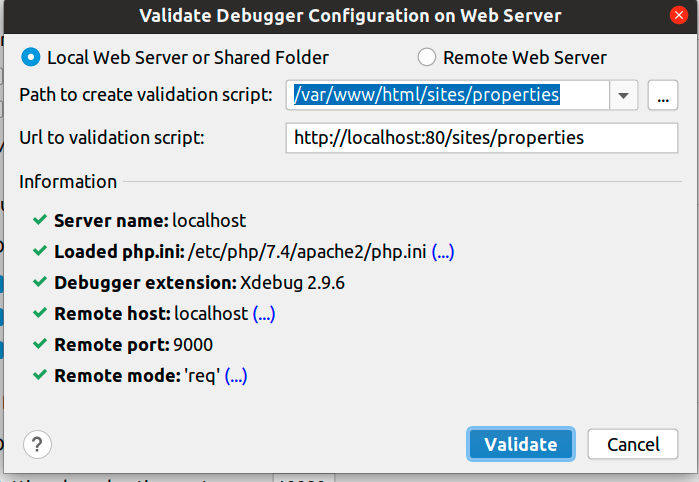
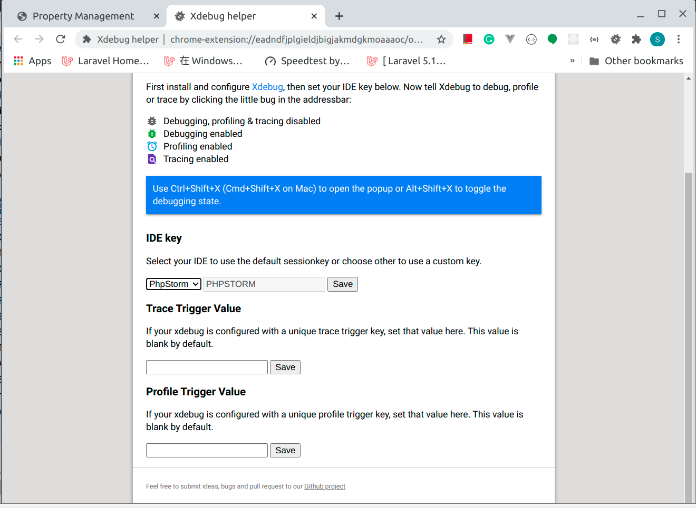
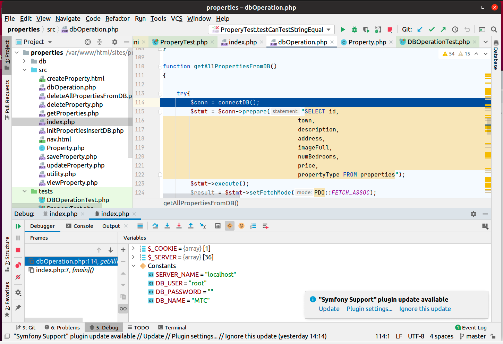

# how-to-install-xdebug-and-config-with-phpstorm-in-ubuntu

To develop a PHP project, Ubuntu is a good choice. But how to debug it when you meet a problem? You can use echo, but it will make your web page messy. So Xdebug is a good choice. And many developers using PHPstorm as an IDE. So, in this paragraph, I will write down how I install Xdebug and config with PHPStorm in Ubuntu.

### Step1: install Xdebug

Following the instructions of the [Xdebug website](https://xdebug.org/docs/install), I try to install Xdebug with PCEL.

```
sudo apt-get install xdebug
```

But, it gave me the error "phpize" didn't find. When I go through the xdebug website, I knew that I need to install PHP development headers. 
So, install php-dev

```
sudo apt-get install php-dev
```

When it's done. I can install xdebug 
```
sudo pecl install xdebug
```

When it's done, system told me 
```
Build process completed successfully
Installing '/usr/lib/php/20190902/xdebug.so
You should add "zend_extension=/usr/lib/php/20190902/xdebug.so" to php.ini
```
 
Find where is my php.ini. 
```
sudo find / -name php.ini 
```
open it and add the following line
```
zend_extension=/usr/lib/php/20190902/xdebug.so
```
after
```
; If you use constants in your value,  and these constants belong to a
; dynamically loaded extension (either a PHP extension or a Zend extension),
; you may only use these constants *after* the line that loads the extension.
```
restart your web server.


*phpinfo xdebug config*

If you can see this, means Xdebug installed right. 

### Step2: Config xdebug

Although there have xdebug.ini, but when I open it, I saw it was generated by robot and not suggested modified by hand. And, it was true! Whateven I changed this file, the xdebug config didn't change anything. 

So, I open the php.ini and add a few lines

```
xdebug.profiler_enable=on # Whether to enable Xdebug performance analysis and create performance information files
xdebug.profiler_output_dir="/tmp" # output dir
xdebug.remote_enable = on # Whether to open remote debug
xdebug.remote_mode=req #Xdebug will try to connect to the debug client as soon as the script starts.
xdebug.remote_host= localhost # remote host ip or name 
xdebug.remote_port = 9000 #port
xdebug.idekey = PHPSTORM #IDE Key
```

After that, I can check the phpinfo() page. And see, every config info is right. 

### Step3: Config PHPStorm

Choose your php version 

*Choose your php version*

Chick the three dot button on the line of CLI Interpreter

You will see this pop up window 

*CLI Interpreters*

Click that + button on the left top and choose /usr/bin/php and then click OK button to close that window.

Now, go back to "Settings" window, make sure you are in the page of "Languages & Frameworks -> PHP -> Servers 

Click + button, in the host input box, you can type in the host name or ip. Host is the web server name or ip, port is the web server port. For apache web server, it is 80. Debugger is Xdebug. 


*Settings server*

Go back to Settings page, choose "Laguages & Frameworks -> PHP -> Debug 


*Settings debug*

make sure the Xdebug Debug port is the same with the xdebug config.

Click the "Pre-configuration" 

1. "Validate" link 

You will see this image


*Validate Debugger Configuration on Web Server*

Make sure the path is where your script in ubuntu and url is the path to visit your project. 

If you can see all the gree tick, means your phpstorm config successfully. 

### Step4: Install chrome xdebug extension and config 

After you install the xdebug extension, don't forget to change the IDE key to PhpStorm. 


*xdebug chrome config*

Now, your configration are all set up. You can start remote debug!

### Step5: Debug!

Open your phpstorm, make sure the "Telephone icon" are "listening for PHP Debug Connections". Set a breakpoint. Open your web page. The app should stop on the break point. F7 for step into, F8 for step over. 


*PHPSTORM Debug picture*

If you wish to stop debug, click that telephone icon. Otherwise, your web server are in the debug model.

That's the end of this article. Enjoy your debugging!

