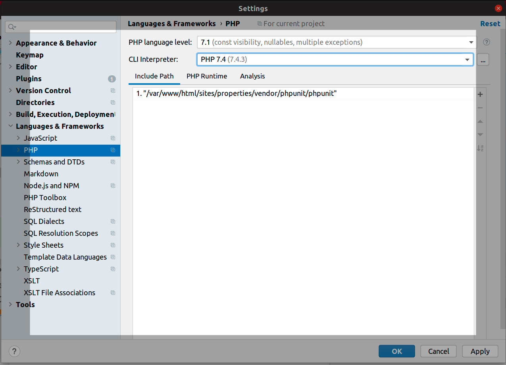

# how-to-install-xdebug-and-config-with-phpstorm-in-ubuntu

To develop a PHP project, Ubuntu is a good choice. But how to debug it when you meet a problem? You can use echo, but it will make your web page messy. So Xdebug is a good choice. And many developers using PHPstorm as an IDE. So, in this paragraph, I will write down how I install Xdebug and config with PHPStorm in Ubuntu.

### Step1: install Xdebug

Following the instructions of the [Xdebug website](https://xdebug.org/docs/install), I try to install Xdebug with PCEL.

```
sudo apt-get install xdebug
```

But, it gave me the error "phpize" didn't find. When I go through the xdebug website, I knew that I need to install PHP development headers. 
So, install php-dev

```
sudo apt-get install php-dev
```

When it's done. I can install xdebug 
```
sudo pecl install xdebug
```

When it's done, system told me 
```
Build process completed successfully
Installing '/usr/lib/php/20190902/xdebug.so
You should add "zend_extension=/usr/lib/php/20190902/xdebug.so" to php.ini
```
 
Find where is my php.ini. 
```
sudo find / -name php.ini 
```
open it and add the following line
```
zend_extension=/usr/lib/php/20190902/xdebug.so
```
after
```
; If you use constants in your value,  and these constants belong to a
; dynamically loaded extension (either a PHP extension or a Zend extension),
; you may only use these constants *after* the line that loads the extension.
```
restart your web server.


*phpinfo xdebug config*

If you can see this, means Xdebug installed right. 

### Step2: Config xdebug

Although there have xdebug.ini, but when I open it, I saw it was generated by robot and not suggested modified by hand. And, it was true! Whateven I changed this file, the xdebug config didn't change anything. 

So, I open the php.ini and add a few lines

```
xdebug.profiler_enable=on # Whether to enable Xdebug performance analysis and create performance information files
xdebug.profiler_output_dir="/tmp" # output dir
xdebug.remote_enable = on # Whether to open remote debug
xdebug.remote_mode=req #Xdebug will try to connect to the debug client as soon as the script starts.
xdebug.remote_host= localhost # remote host ip or name 
xdebug.remote_port = 9000 #port
xdebug.idekey = PHPSTORM #IDE Key
```

After that, I can check the phpinfo() page. And see, every config info is right. 

### Step3: Config PHPStorm

Choose your php version 

*Choose your php version*

Chick the three dot button on the line of CLI Interpreter

You will see this pop up window 

*CLI Interpreters*

Click that + button on the left top and choose /usr/bin/php and then click OK button to close that window.

Now, go back to "Settings" window, make sure you are in the page of "Languages & Frameworks -> PHP -> Servers 

Click + button, in the name input box, you can type in the host name or ip. Host is the web server name or ip, port is the web server port. For apache web server, it is 80. Debugger is Xdebug. 


*Settings server*

Go back to Settings page, choose "Laguages & Frameworks -> PHP -> Debug 


*Settings debug*

make sure the Xdebug Debug port is the same with the xdebug config.


2. 验证配置
information栏目全部展示为绿色的勾则表示phpstorm配置成功


安装浏览器xdebug扩展
如果可以翻墙直接去谷歌扩展商店下载安装


如果无法翻墙点击跳转到这个页面 点我 ，然后打开chrome插件目录页将下载的crx文件托进浏览器即可。然后你会发现浏览器菜单栏会出现一个灰色小虫子，鼠标右击它，选择xdebug helper，将ide key变为phpstorm，其实这个在上面xdebug.ini配置中有解释，所以上面那个配置不用填

然后鼠标左击灰色的虫子，将选项由disable变为debug，然后虫子就变为了绿色，这就代表它已经开始工作了，不过你不需要总是打开它，在你调试的域名下将其开启即可。

在phpstorm针对你的项目进行配置
点击phpstorm菜单栏的RUN


在你想打断点的地方点击一下左边的行号一栏，然后将菜单栏的电话由变为两头都是绿色，然后在浏览器中运行你想调试的页面


返回phpstorm点击F9跳到你打断点的地方，F9为跳到下一个断点，F7为下一步，将鼠标移动到下面的选项上即可看到相应的快捷键


调试得到你想要的结果了点击停止即可结束，记得关闭电话，不然会处于调试状态。当你需要再次调试再去打开它。

